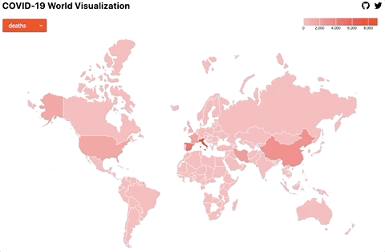

# covid19-d3-visualization

## Overview

A site showing the world map with COVID-19 related data.

## Technologies

This project was built using the following technologies:

- [GatsbyJS](https://www.gatsbyjs.org/)
- [TailwindCSS](https://tailwindcss.com/)
- [D3js](https://d3js.org/)

---

Data provided by [mathdroid covid-19 api](https://github.com/mathdroid/covid-19-api)

**Tested on Chrome only.**

_Disclaimer: I built this site to learn how to use D3js library. It is not meant to be taken as a reliable source of information about COVID-19. I have not verified nor I am associated in any way with the api project from where the information is coming from._
